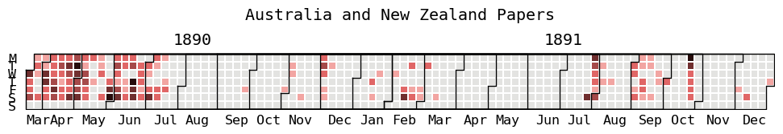
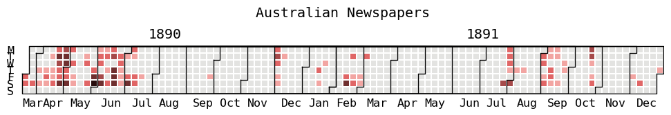
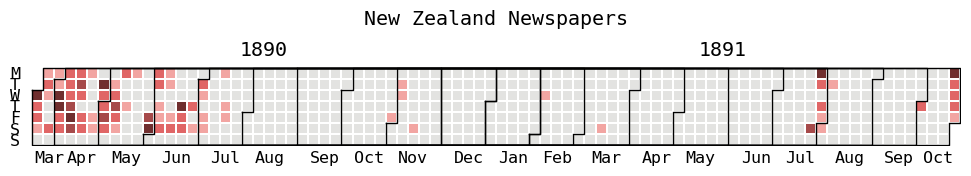
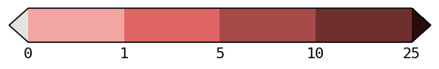
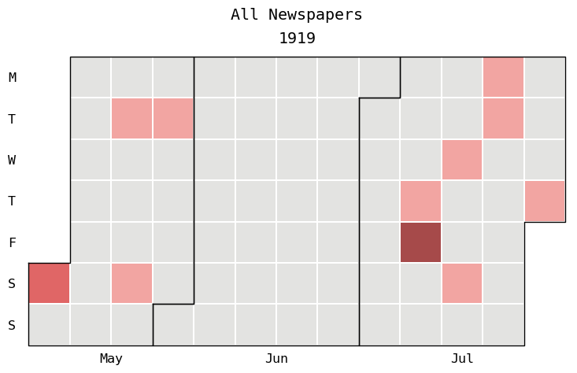
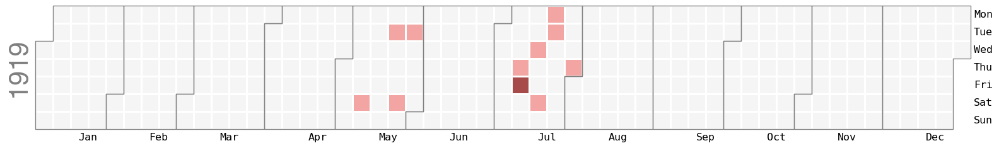

```{r setup, include=FALSE}
knitr::opts_chunk$set(echo = F, cache = F, message = F, warning = F,fig.pos = "H")
```
```{r}
library(readr)
library(anytime)
library(stringr)
library(ggplot2)
library(lubridate)
library(dplyr)
library(knitr)
library(tidyr)
#library(kableExtra)
```

```{r eval=F}
## WRANGLING ##
# importing data
McLeod_Australia <- read_csv("../data/McLeod - Australia articles - Sheet1.csv", show_col_types = FALSE)
McLeod_New_Zealand <- read_csv("../data/McLeod - New Zealand articles - Sheet1.csv", show_col_types = FALSE)

# rename NZ cols to match AUS
# (checked to make sure columns match up)
colnames(McLeod_New_Zealand) <- colnames(McLeod_Australia)

# add country row
McLeod_Australia <- cbind('Australia', McLeod_Australia); colnames(McLeod_Australia)[1]<- 'country'
McLeod_New_Zealand <- cbind('New_Zealand', McLeod_New_Zealand); colnames(McLeod_New_Zealand)[1]<- 'country'

# bind df to one
McLeod <- rbind(McLeod_Australia, McLeod_New_Zealand)

# removing rows with no dates
McLeod <- McLeod[!(is.na(McLeod$DATE)), ]

# removing row with 'time jump'
McLeod <- McLeod[McLeod$DATE != "TIME JUMP",]

# fixing typo (fixed in ggl sheet)
#McLeod$TONE<- str_replace_all(McLeod$TONE, "facutal", "factual")

# EXPORTING AS CSV
write_csv(McLeod, "../data/McLeod.csv")
```

```{r}
# importing wrangled df
McLeod <- read_csv("../data/McLeod.csv", show_col_types = FALSE)
```

# Cleaning
There are only two cases where the Date wasn't in a 'clean' format, shown below. These were left as is and not included in the analysis. 

```{r}
McLeod$Date <- anydate(McLeod$DATE)
kable(McLeod[is.na(McLeod$Date),c(1,2,10)])
```


# Papers
There are `r length(table(McLeod$PAPER))` seemingly distinct newspapers that have reported on the McLeod case. The following table lists the top 10 out, in decreasing order of frequency (The full list was printed in the preliminary report sent previously). I fixed some specific typos to aggregate duplicates(Wiapawa -> Waipawa, Coat -> Coast, added 'Advertiser' on 'The Maitland Mercury and Hunter River General' that had it missing, Ballart -> Ballarat, etc). You can review these and ensure that there aren't more 'duplicates' (see preliminary report).

```{r}
kable(sort(table(McLeod$PAPER), decreasing = TRUE)[1:10], row.names = T)
```

# Counts
## Per Year
```{r eval = F}
ggplot(McLeod) + geom_line(aes(year(Date)), stat = "count") + labs(x='Year', title = "Count of Cases Australia Wide by Year")+scale_x_continuous(n.breaks = 8)
```

```{r eval = F}
ggplot(McLeod) + geom_point(aes(year(Date)), stat = "count") + labs(x='Year', title = "Count of Cases Australia Wide by Year")+scale_x_continuous(n.breaks = 8) 
```

The following plot shows the count of articles per year. We easily see that the most is in 1890, with 621 counts, then 1891 with 171. Then there are years were only 1 or 2 articles appear, and a gap where there are none up until 1919 where there are 18.

```{r}
ggplot(McLeod, aes(year(Date))) + geom_bar(stat = "count")+ stat_count(geom = "text", colour ="black", size = 3.5, aes(label = ..count..), position=position_dodge(width=0.9), vjust=-0.25) +labs(x='Year', title = "Count of McLeod Case Mentions by Year", subtitle = "Across Australia and New Zealand")+scale_x_continuous(n.breaks = 8) 

```

```{r eval = F}
# The following table shows the specific count of articles for the specific year, for easy reference. 
kable(table(year(McLeod$Date)))
```
## Calendar
Next we have a calendar graphic, showing the days on which the case was reported. Gray days have no cases, the lightest pink have 1, and the darkest cell have over 25. We see that the majority of cases from March to July 1890, then there is a cluster of mentions in the months of November 1890 to March 1891, then some clusters in August 1891-October 1891. The four 1892 articles occur in February, May, and October, so are not part of the end of year 1891 cluster. 

We see that New Zealand papers reported on the case two days before Australian papers did, at least in the digital record. We see that there are no mention past October 1891 in New Zealand, but there are more mentions in March and early April than in Australia. The mentions from December 1890 to February 1891 are also more sparse than in Australia.


Interestingly, all the articles from 1919 originate from New Zealand. We see that they only appear in May and July of that year.
```{r out.width="150%", out.extra='angle=90'}






```

```{r eval = F}
McLeod[McLeod$Date<='1919-12-31' & McLeod$Date >='1919-01-01',]
```


The top 10 days with the highest number of mentions are shown in the following table.
```{r}
kable(sort(table(McLeod$Date), decreasing = T)[1:10], row.names = T)
```
```{r}
# splitting time periods
# March 1890 , April 1890 , May 1890, June 1890, July 1890, September 1890- March 1891 , July 1891-December 1891, January 1892-December 1918 , and January 1919-onwards.
# remove nas from date
McLeod <- McLeod[!is.na(McLeod$Date),]
# McLeod[is.na(McLeod$Date),]
# setting group boundaries
group_mcleod <- c(min(McLeod$Date), anydate("1890-03-31"),anydate("1890-04-30"),anydate("1890-05-31"),anydate("1890-06-30",),anydate("1890-07-31"),anydate("1891-03-30"),anydate("1891-12-31"),anydate("1918-12-31"), max(McLeod$Date))

McLeod$group  <- findInterval(McLeod$Date, group_mcleod, all.inside = T, )
McLeod$group <- factor(McLeod$group)
```
# Tone
## All
There are `r sum(!is.na(McLeod$TONE))` cases out of `r nrow(McLeod)` that report a tone; approximately `r round(sum(!is.na(McLeod$TONE))*100/nrow(McLeod),1)`%. The following table shows the count and percentage of times a certain word is used to describe an article. They are not mutually exclusive.
```{r}
# splitting by comma
tone_mcleod <- McLeod %>% mutate(tones_ = strsplit(TONE, ",")) %>%
  unnest(tones_) %>% select(country,group,TONE, tones_)

# removing all spaces
tone_mcleod <- tone_mcleod %>% mutate(nospace_tones = gsub(" ","", tones_))

# splitting by space then removing empty
tone_mcleod <- tone_mcleod %>% mutate(spacesplit_tones = strsplit(tones_, " "))%>%
  unnest(spacesplit_tones)
tone_mcleod <- tone_mcleod[tone_mcleod$spacesplit_tones!="",]

#table(tone_mcleod$nospace_tones)
# kable(cbind(sort(table(tone_mcleod$spacesplit_tones), decreasing = T),
#             paste0(sort(round(prop.table(table(tone_mcleod$spacesplit_tones))*100,1),
#                  decreasing = T),"%")), row.names = T)
```

```{r}
df_tones <- cbind(sort(table(tone_mcleod$spacesplit_tones), decreasing = T),
            paste0(sort(round((table(tone_mcleod$spacesplit_tones)/nrow(McLeod))*100,1),decreasing = T),"%"))
kable(df_tones[!(row.names(df_tones) %in% c("McLeod","M'Leod","with", "to","mildly", "title)","(from", "(ish)", "and","towards","slighty")),], row.names = T, col.names = c("Count","Percentage"))
```


The next table shows the top 10 whole descriptors (mutually exclusive). We see that most often, the tone is **only** 'factual', but next most common is 'factual' and 'scoundrel' pairings.
```{r}
kable(cbind(sort(table(McLeod$TONE), decreasing =  T),
            paste0(sort(round(prop.table(table(McLeod$TONE))*100,1),
                 decreasing = T),"%"))[1:10,], row.names = T, col.names = c("Count","Percentage"))
```

## By Country

The following table is the result in Australian papers (n = `r sum(McLeod$country == "Australia", na.rm = T)`): 83.4% of Australian articles have a 'factual' tone.
```{r}
df_tones_aus <- cbind(sort(table(tone_mcleod[tone_mcleod$country == "Australia",'spacesplit_tones']), decreasing = T),
            paste0(sort(round((table(tone_mcleod[tone_mcleod$country == "Australia",'spacesplit_tones'])/sum(McLeod$country == "Australia"))*100,1),decreasing = T),"%"))
kable(df_tones_aus[!(row.names(df_tones_aus) %in% c("McLeod","M'Leod","with", "to","mildly", "title)","(from", "(ish)", "and","towards","slighty")),], row.names = T, col.names = c("Count","Percentage"))
```
The top ten mutually exclusive list for Australia is as follows:
```{r}
kable(cbind(sort(table(McLeod[McLeod$country == "Australia", 'TONE']), decreasing =  T),
            paste0(sort(round(prop.table(table(McLeod[McLeod$country == "Australia", 'TONE']))*100,1),
                 decreasing = T),"%"))[1:10,], row.names = T, col.names = c("Count","Percentage"))
```

For New Zealand (n = `r sum(McLeod$country == "New_Zealand", na.rm = T)`), 91.7% have a 'factual' tone, a higher percentage than Australia.
```{r}
df_tones_nz <- cbind(sort(table(tone_mcleod[tone_mcleod$country == "New_Zealand",'spacesplit_tones']), decreasing = T),
            paste0(sort(round((table(tone_mcleod[tone_mcleod$country == "New_Zealand",'spacesplit_tones'])/sum(McLeod$country == "New_Zealand"))*100,1),decreasing = T),"%"))
kable(df_tones_nz[!(row.names(df_tones_nz) %in% c("McLeod","M'Leod","with", "to","mildly", "title)","(from", "(ish)", "and","towards","slighty")),], row.names = T, col.names = c("Count","Percentage"))
```
The top ten mutually exclusive list for New Zealand is as follows:
```{r}
kable(cbind(sort(table(McLeod[McLeod$country == "New_Zealand", 'TONE']), decreasing =  T),
            paste0(sort(round(prop.table(table(McLeod[McLeod$country == "New_Zealand", 'TONE']))*100,1),
                 decreasing = T),"%"))[1:10,], row.names = T, col.names = c("Count","Percentage"))
```

## By Time Period
I will crudely split the time periods by 'grouping' I saw in the previous calendar plots, and the first few months by smaller periods since they contain more articles: March 1890 , April 1890 , May 1890, June 1890, July 1890 (end of first wave), September 1890- March 1891 (second wave), July 1891-December 1891 (third wave), January 1892-December 1918 (in between), and January 1919-onwards (last peak).

We see in the next tables that overall, the percentage of articles with a 'factual' tone in the time periods is not exactly constant, but is mostly in the 80%s, and past 1891, in the 90%s.

The vast majority of 'scoundrel' tones occur in the first wave (March - July 1890), with other four counts outside of that wave, two of which are in the second wave, and the last two in the third wave. There are no mention of 'scoundrel' in the tone past 1891. 

Conversely, it seems like most 'critical' tones occur a bit later. Only 7 occur in the first wave, 2 in the second, 15 in the third, and 2 past 1891. 

Most 'sensational' tones occur in April 1980 (19; first wave).

March 1890: (n = `r sum(McLeod$group == 1, na.rm = T)`)
```{r}
n = 1
df_tones_1 <- cbind(sort(table(tone_mcleod[tone_mcleod$group == n ,'spacesplit_tones']), decreasing = T),
            paste0(sort(round((table(tone_mcleod[tone_mcleod$group ==n, 'spacesplit_tones'])/sum(McLeod$group == n, na.rm = T))*100,1),decreasing = T),"%"))
kable(df_tones_1[!(row.names(df_tones_1) %in% c("McLeod","M'Leod","with", "to","mildly", "title)","(from", "(ish)", "and","towards","slighty")),], row.names = T, col.names = c("Count","Percentage"))
```

April 1890: (n = `r sum(McLeod$group == n+1, na.rm = T)`)
```{r}
n = n+1
df_tones_1 <- cbind(sort(table(tone_mcleod[tone_mcleod$group == n ,'spacesplit_tones']), decreasing = T),
            paste0(sort(round((table(tone_mcleod[tone_mcleod$group ==n, 'spacesplit_tones'])/sum(McLeod$group == n, na.rm = T))*100,1),decreasing = T),"%"))
kable(df_tones_1[!(row.names(df_tones_1) %in% c("McLeod","M'Leod","with", "to","mildly", "title)","(from", "(ish)", "and","towards","slighty")),], row.names = T, col.names = c("Count","Percentage"))
```
May 1890: (n = `r sum(McLeod$group == n+1, na.rm = T)`)
```{r}
n = n+1
df_tones_1 <- cbind(sort(table(tone_mcleod[tone_mcleod$group == n ,'spacesplit_tones']), decreasing = T),
            paste0(sort(round((table(tone_mcleod[tone_mcleod$group ==n, 'spacesplit_tones'])/sum(McLeod$group == n, na.rm = T))*100,1),decreasing = T),"%"))
kable(df_tones_1[!(row.names(df_tones_1) %in% c("McLeod","M'Leod","with", "to","mildly", "title)","(from", "(ish)", "and","towards","slighty")),], row.names = T, col.names = c("Count","Percentage"))
```

June 1890: (n = `r sum(McLeod$group == n+1, na.rm = T)`)
```{r}
n = n+1
df_tones_1 <- cbind(sort(table(tone_mcleod[tone_mcleod$group == n ,'spacesplit_tones']), decreasing = T),
            paste0(sort(round((table(tone_mcleod[tone_mcleod$group ==n, 'spacesplit_tones'])/sum(McLeod$group == n, na.rm = T))*100,1),decreasing = T),"%"))
kable(df_tones_1[!(row.names(df_tones_1) %in% c("McLeod","M'Leod","with", "to","mildly", "title)","(from", "(ish)", "and","towards","slighty")),], row.names = T, col.names = c("Count","Percentage"))
```
July 1890: (n = `r sum(McLeod$group == n+1, na.rm = T)`)
```{r}
n = n+1
df_tones_1 <- cbind(sort(table(tone_mcleod[tone_mcleod$group == n ,'spacesplit_tones']), decreasing = T),
            paste0(sort(round((table(tone_mcleod[tone_mcleod$group ==n, 'spacesplit_tones'])/sum(McLeod$group == n, na.rm = T))*100,1),decreasing = T),"%"))
kable(df_tones_1[!(row.names(df_tones_1) %in% c("McLeod","M'Leod","with", "to","mildly", "title)","(from", "(ish)", "and","towards","slighty")),], row.names = T, col.names = c("Count","Percentage"))
```
September 1890- March 1891 (second wave): (n = `r sum(McLeod$group == n+1, na.rm = T)`)
```{r}
n = n+1
df_tones_1 <- cbind(sort(table(tone_mcleod[tone_mcleod$group == n ,'spacesplit_tones']), decreasing = T),
            paste0(sort(round((table(tone_mcleod[tone_mcleod$group ==n, 'spacesplit_tones'])/sum(McLeod$group == n, na.rm = T))*100,1),decreasing = T),"%"))
kable(df_tones_1[!(row.names(df_tones_1) %in% c("McLeod","M'Leod","with", "to","mildly", "title)","(from", "(ish)", "and","towards","slighty")),], row.names = T, col.names = c("Count","Percentage"))
```
July 1891-December 1891 (third wave): (n = `r sum(McLeod$group == n+1, na.rm = T)`)
```{r}
n = n+1
df_tones_1 <- cbind(sort(table(tone_mcleod[tone_mcleod$group == n ,'spacesplit_tones']), decreasing = T),
            paste0(sort(round((table(tone_mcleod[tone_mcleod$group ==n, 'spacesplit_tones'])/sum(McLeod$group == n, na.rm = T))*100,1),decreasing = T),"%"))
kable(df_tones_1[!(row.names(df_tones_1) %in% c("McLeod","M'Leod","with", "to","mildly", "title)","(from", "(ish)", "and","towards","slighty")),], row.names = T, col.names = c("Count","Percentage"))
```
January 1892-December 1918 (between waves): (n = `r sum(McLeod$group == n+1, na.rm = T)`)
```{r}
n = n+1
df_tones_1 <- cbind(sort(table(tone_mcleod[tone_mcleod$group == n ,'spacesplit_tones']), decreasing = T),
            paste0(sort(round((table(tone_mcleod[tone_mcleod$group ==n, 'spacesplit_tones'])/sum(McLeod$group == n, na.rm = T))*100,1),decreasing = T),"%"))
kable(df_tones_1[!(row.names(df_tones_1) %in% c("McLeod","M'Leod","with", "to","mildly", "title)","(from", "(ish)", "and","towards","slighty")),], row.names = T, col.names = c("Count","Percentage"))
```
January 1919-onwards (last peak): (n = `r sum(McLeod$group == n+1, na.rm = T)`)
```{r}
n = n+1
df_tones_1 <- cbind(sort(table(tone_mcleod[tone_mcleod$group == n ,'spacesplit_tones']), decreasing = T),
            paste0(sort(round((table(tone_mcleod[tone_mcleod$group ==n, 'spacesplit_tones'])/sum(McLeod$group == n, na.rm = T))*100,1),decreasing = T),"%"))
kable(df_tones_1[!(row.names(df_tones_1) %in% c("McLeod","M'Leod","with", "to","mildly", "title)","(from", "(ish)", "and","towards","slighty")),], row.names = T, col.names = c("Count","Percentage"))
```
# Offense
## All
There are `r sum(!is.na(McLeod$OFFENSE))` cases out of `r nrow(McLeod)` that report an offense; approximately `r round(sum(!is.na(McLeod$OFFENSE))*100/nrow(McLeod),1)`%. The following table shows the count and percentage of times a certain offense occurs in an article. They are not mutually exclusive. It shows that bigamy is a recorded offense 93% of the time.

```{r}
# splitting by comma, and dealing with specific 'rape and bigamy' case and 'adultery with bigamy'
offense_mcleod <- McLeod %>% 
  mutate(OFFENSE = str_replace_all(OFFENSE,"rape and","rape,")) %>%
  mutate(OFFENSE = str_replace_all(OFFENSE,"adultery with","adultery,")) %>%
  mutate(offense_ = strsplit(OFFENSE, ",")) %>%
  unnest(offense_) %>% select(country,group,OFFENSE, offense_)

# removing first spaces
offense_mcleod <- offense_mcleod %>% mutate(nofirstspace_offense = gsub("^ ", "", offense_))

# remove quotations
offense_mcleod$nofirstspace_offense <- str_replace_all(offense_mcleod$nofirstspace_offense, "'","")

# printing table with percentage
kable(cbind(sort(table(offense_mcleod$nofirstspace_offense), decreasing = T),
            paste0(sort(round(table(offense_mcleod$nofirstspace_offense)*100/nrow(McLeod),1), decreasing = T),"%")), row.names = T, col.names = c("Count","Percentage"))
```
The next table shows the whole descriptors as is in the data (mutually exclusive). It shows that for 64% of the time, the **only** offense recorded is 'bigamy', and for 9.4% of the time, it is bigamy and criminal assault.
```{r}
kable(cbind(sort(table(McLeod$OFFENSE), decreasing = T),
            paste0(sort(round(table(McLeod$OFFENSE)*100/nrow(McLeod),1), decreasing = T),"%")), row.names = T, col.names = c("Count","Percentage"))
```


## No Bigamy mentionned
The following table shows the offences where no bigamy was mentioned. These account for a total of `r sum(!is.na(McLeod[str_detect(McLeod$OFFENSE, "bigamy not mentioned") | !str_detect(McLeod$OFFENSE, "bigamy"),"OFFENSE"]))` cases, or `r round(sum(!is.na(McLeod[str_detect(McLeod$OFFENSE, "bigamy not mentioned") | !str_detect(McLeod$OFFENSE, "bigamy"),"OFFENSE"]))*100/nrow(McLeod),1)`%. (The sum of the percentages in the table doesn't add to the same because they are rounded to 1 decimal place). 51 of these cases occur in April 1980, and 3 in May 1980.
```{r}
# where no bigamy: either 'bigamy not mentioned' or no 'bigamy'
kable(cbind(sort(table(McLeod[str_detect(McLeod$OFFENSE, "bigamy not mentioned") | !str_detect(McLeod$OFFENSE, "bigamy"),"OFFENSE"]), decreasing = T), paste0(sort(round(table(McLeod[str_detect(McLeod$OFFENSE, "bigamy not mentioned") | !str_detect(McLeod$OFFENSE, "bigamy"),"OFFENSE"])*100/nrow(McLeod),1), decreasing = T),"%")), col.names = c("Count","Percentage"))
```

## By Country
For Australia, 98.7% of offense contain 'bigamy' as shown in the following table.
```{r}
# Australia
kable(cbind(sort(table(offense_mcleod[offense_mcleod$country == "Australia",'nofirstspace_offense']), decreasing = T),
            paste0(sort(round(table(offense_mcleod[offense_mcleod$country == "Australia",'nofirstspace_offense'])*100/sum(McLeod$country == "Australia"),1), decreasing = T),"%")), row.names = T, col.names = c("Count","Percentage"))
```
For New Zealand, the proportion is smaller, at 86.1%, as shown in the following table. There are more cases of 'attempted rape' offenses and less of 'rape' offense in New Zealand papers than in Australian papers. 
```{r}
# NZ
kable(cbind(sort(table(offense_mcleod[offense_mcleod$country == "New_Zealand",'nofirstspace_offense']), decreasing = T),
            paste0(sort(round(table(offense_mcleod[offense_mcleod$country == "New_Zealand",'nofirstspace_offense'])*100/sum(McLeod$country == "New_Zealand"),1), decreasing = T),"%")), row.names = T, col.names = c("Count","Percentage"))
```

## By Time Period
With the same time periods by 'grouping' as above: March 1890 , April 1890 , May 1890, June 1890, July 1890 (end of first wave), September 1890- March 1891 (second wave), July 1891-December 1891 (third wave), January 1892-December 1918 (in between), and January 1919-onwards (last peak).

We see that for most time periods, 'bigamy' is 100% of the time (or near) in the offense, apart from in April 1980, when it is only 76.9%. 

March 1890: (n = `r sum(McLeod$group == 1, na.rm = T)`)
```{r}
# I should make a function from this code and just call the function
n = 1
df_tones_1 <- cbind(sort(table(offense_mcleod[offense_mcleod$group == n ,'nofirstspace_offense']), decreasing = T),
            paste0(sort(round((table(offense_mcleod[offense_mcleod$group ==n, 'nofirstspace_offense'])/sum(McLeod$group == n, na.rm = T))*100,1),decreasing = T),"%"))
kable(df_tones_1[!(row.names(df_tones_1) %in% c("McLeod","M'Leod","with", "to","mildly", "title)","(from", "(ish)", "and","towards","slighty")),], row.names = T, col.names = c("Count","Percentage"))
```

April 1890: (n = `r sum(McLeod$group == n+1, na.rm = T)`)
```{r}
n = n+1
df_tones_1 <- cbind(sort(table(offense_mcleod[offense_mcleod$group == n ,'nofirstspace_offense']), decreasing = T),
            paste0(sort(round((table(offense_mcleod[offense_mcleod$group ==n, 'nofirstspace_offense'])/sum(McLeod$group == n, na.rm = T))*100,1),decreasing = T),"%"))
kable(df_tones_1[!(row.names(df_tones_1) %in% c("McLeod","M'Leod","with", "to","mildly", "title)","(from", "(ish)", "and","towards","slighty")),], row.names = T, col.names = c("Count","Percentage"))
```
May 1890: (n = `r sum(McLeod$group == n+1, na.rm = T)`)
```{r}
n = n+1
df_tones_1 <- cbind(sort(table(offense_mcleod[offense_mcleod$group == n ,'nofirstspace_offense']), decreasing = T),
            paste0(sort(round((table(offense_mcleod[offense_mcleod$group ==n, 'nofirstspace_offense'])/sum(McLeod$group == n, na.rm = T))*100,1),decreasing = T),"%"))
kable(df_tones_1[!(row.names(df_tones_1) %in% c("McLeod","M'Leod","with", "to","mildly", "title)","(from", "(ish)", "and","towards","slighty")),], row.names = T, col.names = c("Count","Percentage"))
```

June 1890: (n = `r sum(McLeod$group == n+1, na.rm = T)`)
```{r}
n = n+1
df_tones_1 <- cbind(sort(table(offense_mcleod[offense_mcleod$group == n ,'nofirstspace_offense']), decreasing = T),
            paste0(sort(round((table(offense_mcleod[offense_mcleod$group ==n, 'nofirstspace_offense'])/sum(McLeod$group == n, na.rm = T))*100,1),decreasing = T),"%"))
kable(df_tones_1[!(row.names(df_tones_1) %in% c("McLeod","M'Leod","with", "to","mildly", "title)","(from", "(ish)", "and","towards","slighty")),], row.names = T, col.names = c("Count","Percentage"))
```
July 1890: (n = `r sum(McLeod$group == n+1, na.rm = T)`)
```{r}
n = n+1
df_tones_1 <- cbind(sort(table(offense_mcleod[offense_mcleod$group == n ,'nofirstspace_offense']), decreasing = T),
            paste0(sort(round((table(offense_mcleod[offense_mcleod$group ==n, 'nofirstspace_offense'])/sum(McLeod$group == n, na.rm = T))*100,1),decreasing = T),"%"))
kable(df_tones_1[!(row.names(df_tones_1) %in% c("McLeod","M'Leod","with", "to","mildly", "title)","(from", "(ish)", "and","towards","slighty")),], row.names = T, col.names = c("Count","Percentage"))
```
September 1890- March 1891 (second wave): (n = `r sum(McLeod$group == n+1, na.rm = T)`)
```{r}
n = n+1
df_tones_1 <- cbind(sort(table(offense_mcleod[offense_mcleod$group == n ,'nofirstspace_offense']), decreasing = T),
            paste0(sort(round((table(offense_mcleod[offense_mcleod$group ==n, 'nofirstspace_offense'])/sum(McLeod$group == n, na.rm = T))*100,1),decreasing = T),"%"))
kable(df_tones_1[!(row.names(df_tones_1) %in% c("McLeod","M'Leod","with", "to","mildly", "title)","(from", "(ish)", "and","towards","slighty")),], row.names = T, col.names = c("Count","Percentage"))
```
July 1891-December 1891 (third wave): (n = `r sum(McLeod$group == n+1, na.rm = T)`)
```{r}
n = n+1
df_tones_1 <- cbind(sort(table(offense_mcleod[offense_mcleod$group == n ,'nofirstspace_offense']), decreasing = T),
            paste0(sort(round((table(offense_mcleod[offense_mcleod$group ==n, 'nofirstspace_offense'])/sum(McLeod$group == n, na.rm = T))*100,1),decreasing = T),"%"))
kable(df_tones_1[!(row.names(df_tones_1) %in% c("McLeod","M'Leod","with", "to","mildly", "title)","(from", "(ish)", "and","towards","slighty")),], row.names = T, col.names = c("Count","Percentage"))
```
January 1892-December 1918 (between waves): (n = `r sum(McLeod$group == n+1, na.rm = T)`)
```{r}
n = n+1
df_tones_1 <- cbind(sort(table(offense_mcleod[offense_mcleod$group == n,'nofirstspace_offense']), decreasing = T),
            paste0(sort(round((table(offense_mcleod[offense_mcleod$group ==n, 'nofirstspace_offense'])/sum(McLeod$group == n, na.rm = T))*100,1),decreasing = T),"%"))
kable(df_tones_1[!(row.names(df_tones_1) %in% c("McLeod","M'Leod","with", "to","mildly", "title)","(from", "(ish)", "and","towards","slighty")),], row.names = T, col.names = c("Count","Percentage"))
```
January 1919-onwards (last peak): (n = `r sum(McLeod$group == n+1, na.rm = T)`)
```{r}
n = n+1
df_tones_1 <- cbind(sort(table(offense_mcleod[offense_mcleod$group == n ,'nofirstspace_offense']), decreasing = T),
            paste0(sort(round((table(offense_mcleod[offense_mcleod$group ==n, 'nofirstspace_offense'])/sum(McLeod$group == n, na.rm = T))*100,1),decreasing = T),"%"))
kable(df_tones_1, row.names = T, col.names = c("Count","Percentage"))
```


